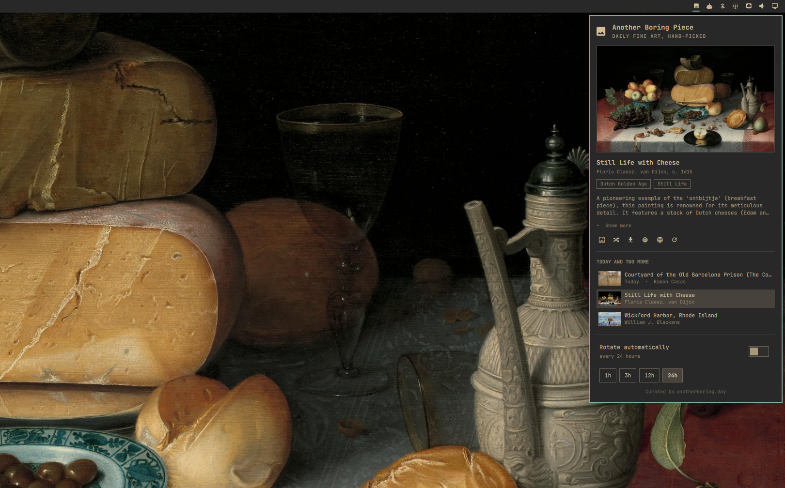

# Another Boring Piece — for Omarchy



Hand-picked fine art from [anotherboring.day](https://anotherboring.day) as your
Omarchy background. A pill in the bar opens today's piece plus two more, one
click sets any of them, and an optional schedule keeps the wall moving.

The Omarchy port of the
[Raycast extension](https://github.com/raycast/extensions/tree/main/extensions/another-boring-piece)
of the same name: same public endpoints, no account, no API key.

Requires Omarchy 4 (the Quickshell-based `omarchy-shell`).

## Install

```bash
omarchy plugin add https://github.com/jopesh/omarchy-boringday.git --enable
```

Or from a checkout — the directory must be named for the plugin id, since that
is where the shell looks:

```bash
git clone https://github.com/jopesh/omarchy-boringday.git \
  ~/.config/omarchy/plugins/boringday.wallpapers
omarchy-shell shell rescanPlugins
omarchy plugin enable boringday.wallpapers right
```

## Using it

Click the 󰋩 pill to open the panel; right-click shuffles a random piece without
opening anything, middle-click refetches today's set. The pill takes the accent
color while rotation is on.

The three rows are a selector: browsing previews a piece, and the wall only
changes when you set it.

| Key       | Action                                            |
|-----------|---------------------------------------------------|
| `↑` / `↓` | Move the cursor — browsing a piece previews it     |
| `Enter`   | Set the previewed piece as the background          |
| `s`       | Shuffle — set a random piece                       |
| `t`       | Add the previewed piece to the current theme       |
| `d`       | Save a copy to your pictures folder                |
| `e`       | Expand or collapse a truncated description         |
| `o`       | Open the piece's page on anotherboring.day         |
| `r`       | Fetch today's set again                            |
| `a`       | Toggle automatic rotation                          |
| `←` / `→` | Pick the rotation period when the cursor is on it  |
| `i`       | Cycle the rotation period                          |
| `Esc`     | Close                                              |

### Keeping a piece

Setting a piece moves Omarchy's current-background symlink, and that symlink
belongs to the theme — switch themes, or cycle with `omarchy theme bg next`,
and the piece is gone.

`t` makes it permanent: the image is copied into
`~/.config/omarchy/backgrounds/<theme>/`, the folder that rotation reads from,
so the piece becomes one of the theme's own backgrounds. Adding the same piece
twice does nothing, and if it is the piece on screen the symlink moves onto the
permanent copy.

## From the command line

The service registers a `boringday` IPC target, so everything works with no bar
widget on screen — from a keybinding, a script, or over ssh into the session.

```bash
omarchy-shell boringday random          # set a random piece now
omarchy-shell boringday today           # set today's piece
omarchy-shell boringday install         # add the piece on the wall to this theme
omarchy-shell boringday auto toggle     # on | off | toggle
omarchy-shell boringday interval 1800   # seconds
omarchy-shell boringday current         # what's on the wall
omarchy-shell boringday status          # JSON: interval, next change, errors
omarchy-shell boringday refresh         # refetch today's set
```

A Hyprland binding, in `~/.config/hypr/bindings.conf`:

```
bindd = SUPER SHIFT, W, Another boring piece, exec, omarchy-shell boringday random
```

## Settings

Settings live inline on the plugin's entry in `~/.config/omarchy/shell.json`,
the same place every other bar widget keeps its settings — so the panel's
toggle and the `boringday auto` call are the same switch.

```jsonc
{ "id": "boringday.wallpapers",
  "autoRotate": true,        // rotate on a schedule
  "intervalSeconds": 3600,   // 1h / 3h / 12h / 24h from the panel
  "notify": true }           // notification naming each piece as it changes
```

The interval is wall-clock, not uptime: the last change is persisted, so
restarting the shell resumes the schedule rather than granting a fresh hour.
Rotation only advances while `omarchy-shell` is running.

## Where things land

| Path                                          | What                                              |
|-----------------------------------------------|---------------------------------------------------|
| `~/.cache/omarchy/boringday/wallpapers/`      | Full-size images, newest 20 kept                  |
| `~/.cache/omarchy/boringday/thumbs/`          | Panel previews, newest 60 kept                    |
| `~/.local/state/omarchy/boringday/state.json` | Last change, current piece, recently-seen ids     |
| `~/.config/omarchy/backgrounds/<theme>/`      | Pieces added with `t`, kept until you delete them |
| `$(xdg-user-dir PICTURES)`                    | Copies saved with `d`, never overwritten          |

The list of pieces is not persisted — it is rebuilt on every start. The piece
on your wall is, whole record and all, so the panel opens describing what is on
screen without asking the server for anything.

## How it fits together

`Service.qml` is headless and loaded once per session: it owns every fetch, the
caches, the rotation schedule, and the `boringday` IPC target. `Panel.qml` is
the bar pill and its popup, and pure view — a bar surface exists per monitor,
so it owns no state. `Model.js` holds the parts worth reading alone: the CDN
thumbnail transforms, response parsing, and state serialization.

Images are fetched to disk with `curl` and rendered from local files, so a
dropped network degrades to a stale preview rather than a broken one. Nothing
off the network is taken on trust: responses have a size `curl` refuses to
exceed mid-download, records are cut to a bounded shape, and every image is
checked against its own header — type and decoded dimensions — before it is
previewed or set. The ceilings are the `MAX_` constants at the top of
`Model.js`.

## License

MIT. The artwork belongs to anotherboring.day and the respective museums and
estates; this plugin only points your desktop at it.
